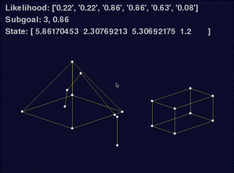

# BeagleBone-excavator
BeagleBone control scripts in Python, written for my master's thesis project. Experimental setup consists of a MacBook sending USB joystick inputs via UDP, and a BeagleBone Black receiving commands. A prediction and blending algorithm modifies the operator commands and sends PWM signals to the RC excavator. Measurement of excavator pose is achieved by string potentiometers and analog inputs. Utilizes Adafruit_BBIO, pygame, ... 

## tests
Contains the main control scripts. The control modes are implemented the scripts manual.py, blended.py, and autonomous.py, which rely on the excavator module in the same directory.

## simulator
A (very limited) 3D wireframe excavator simulator using pygame and some examples from [Peter Collingridge's blog](http://www.petercollingridge.co.uk/pygame-3d-graphics-tutorial). Although this is not what pygame was intended for, I was able to use the joystick support and get very good results fairly quickly.
